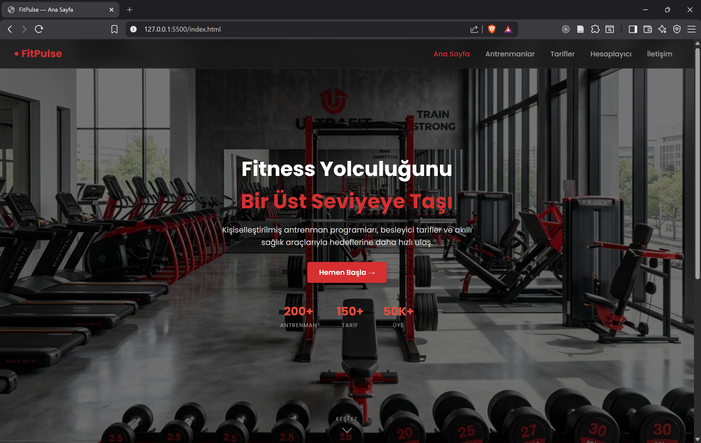
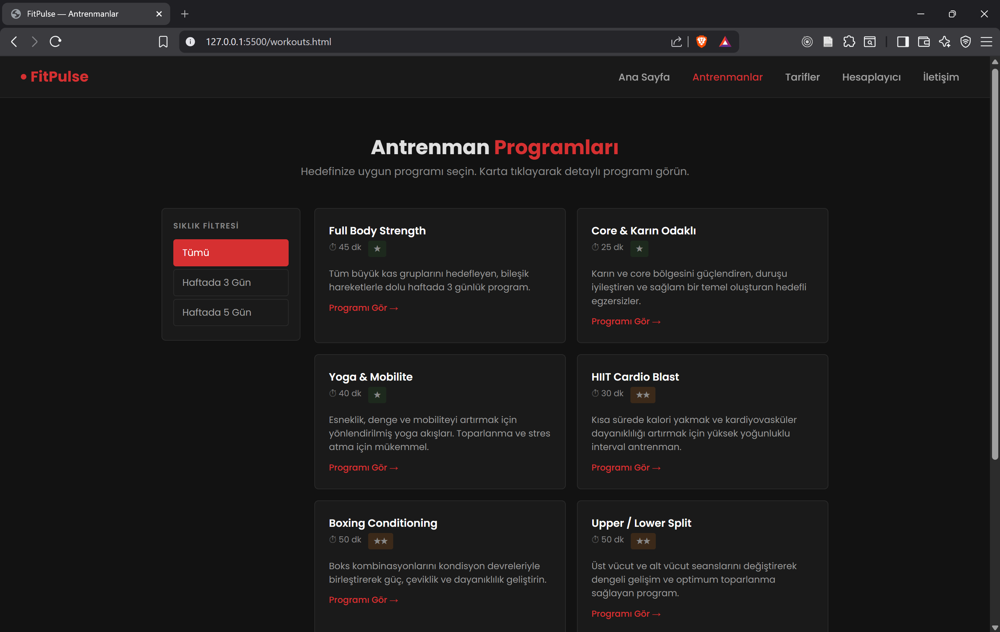
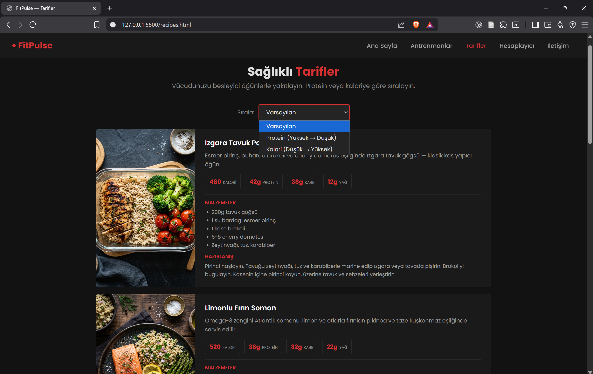

# ITP Front-End Assignment Website

A multi-page front-end course assignment built with **HTML, CSS, and JavaScript**.

This project includes a home page, recipes page, workouts page, calculator page, and contact page. The goal was to practice core web development skills such as page structure, responsive design, reusable styling, and basic interactivity.

## Live Preview

You can run the project locally by opening `index.html` in your browser.

## Screenshots

### Home Page


### Workouts Page


### Recipes Page


## Features

- Multi-page static website structure
- Responsive layout with separated style files
- Recipe and workout content pages
- Simple calculator functionality
- Contact page layout and form structure

## Tech Stack

- HTML5
- CSS3
- JavaScript (Vanilla)

## Project Structure

```text
.
├── index.html
├── recipes.html
├── workouts.html
├── calculator.html
├── contact.html
├── script.js
├── style.css
├── styles/
│   ├── base.css
│   ├── home.css
│   ├── recipes.css
│   ├── workouts.css
│   ├── calculator-contact.css
│   └── responsive.css
└── images/
    ├── github/
    │   ├── anasayfa.png
    │   ├── antrenmanlar.png
    │   └── tarifler.png
    └── ...
```

## Getting Started

1. Clone or download this repository.
2. Open the project folder.
3. Launch `index.html` in your browser.

## Purpose

This repository was prepared as a university course assignment and portfolio-style practice project.
